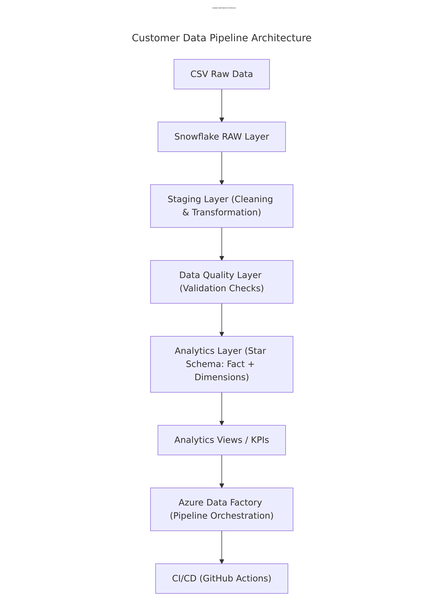
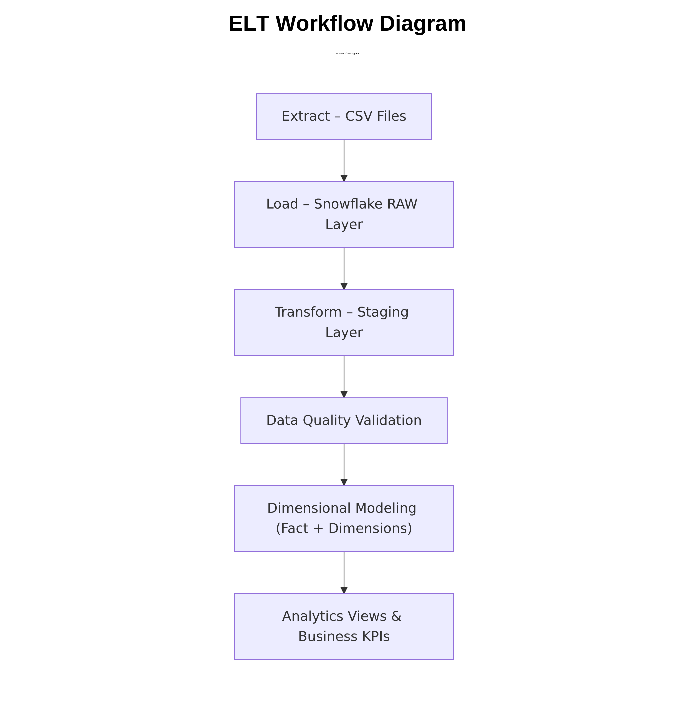
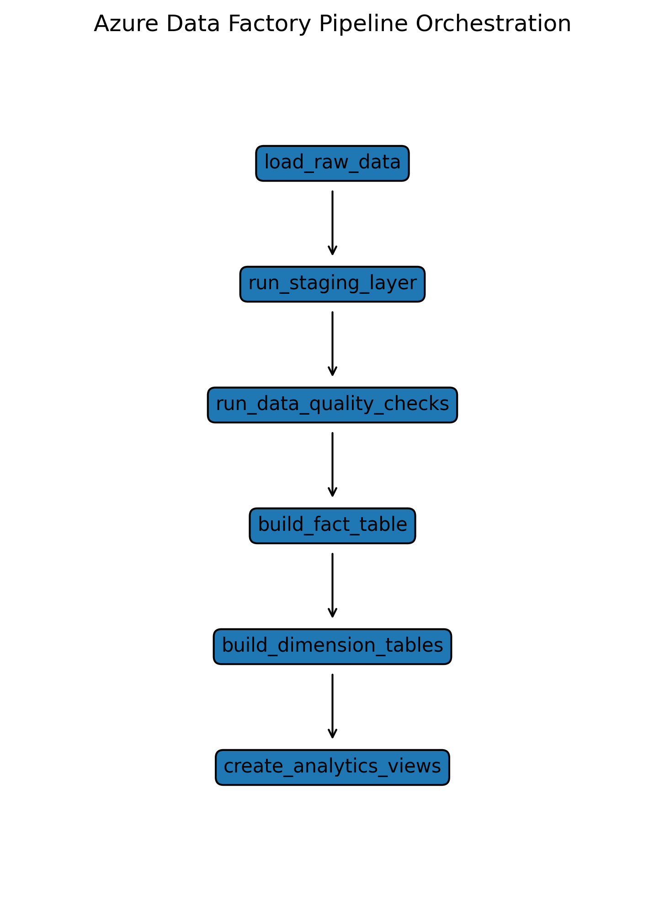
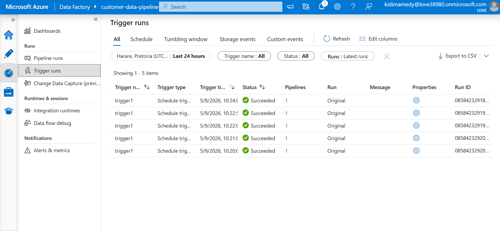
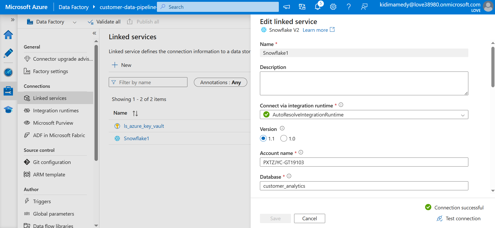
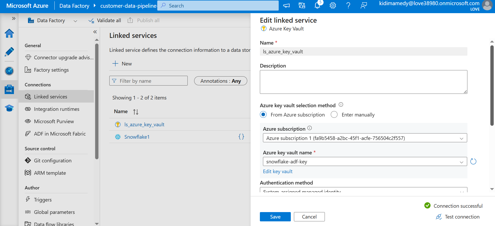

# Snowflake Data Pipeline CI/CD [](https://github.com/Medy682/Customer_Analytics_Data_Pipeline/actions/workflows/snowflake_pipeline.yml)


Customer Analytics Data Pipeline

Author: Kidima Medy Masuka 

Date: 2026

# 🚀 Customer Data Analytics Pipeline

## ✔ Project Overview

The Customer Data Analytics Pipeline is an end-to-end ELT data engineering solution designed to ingest, process, transform, and analyze customer sales data using a modern cloud data stack.

In this project, I designed and deployed a complete Snowflake-based ELT pipeline integrated with Azure Data Factory, Azure Key Vault, and GitHub Actions CI/CD automation. The solution was built using enterprise-style cloud data engineering practices with a strong focus on orchestration, security, automation, reliability, and production-ready deployment workflows.

I implemented:

* Snowflake cloud data warehousing

* Azure Data Factory orchestration

* Azure Key Vault secret management

* RSA key-pair authentication

* GitHub Actions CI/CD automation

* Incremental loading using CDC and watermarking

* Secure credential and secret handling

* Scheduled trigger orchestration

* Multi-layer data validation and monitoring

One of the key achievements in this project was successfully implementing idempotent SQL deployment scripts and standardized object creation logic to eliminate environment-specific SQL compilation failures such as "Object Already Exists" errors. This resulted in a stable, fully automated “green-light” CI/CD deployment workflow with reliable repeatable deployments.


# 🏗️ Architecture & Flow

The pipeline leverages Snowflake as the cloud data warehouse. Data is extracted from CSV source files, ingested into a Raw Layer, and progressively transformed through:

* a Staging Layer for cleaning and preparation,

* and an Analytics Layer for reporting and business insights.

The final Analytics Layer utilizes Dimensional Modelling (Star Schema) to support analytical querying, optimized reporting performance, and actionable business intelligence.

Azure Data Factory was used to orchestrate and schedule the complete workflow end-to-end, while Azure Key Vault securely managed secrets and RSA private keys used for Snowflake authentication.


# 🛠️ Core Engineering Practices

## ➡ Idempotency & Deployment Reliability


One of the biggest engineering challenges I solved in this project was fixing repeated database deployment failures in the CI/CD pipeline.

The problem was that the automated deployment scripts kept failing whenever they attempted to create database objects that already existed in Snowflake. This caused frequent SQL compilation errors such as:

* `"Object Already Exists"`
* schema conflicts,
* and inconsistent deployment behavior across environments.

To solve this, I redesigned and standardized the SQL object creation scripts using `IF NOT EXISTS` logic and repeatable deployment patterns. Instead of blindly creating objects every time, the scripts now first check the database state before making changes.

In simple terms, I fixed the deployment process by making the scripts “smart enough” to verify whether an object already exists before trying to create it again.

This transformed the deployment workflow from:

* a fragile, manual troubleshooting process,
  into:
* a stable, reliable, fully automated “green-light” CI/CD system.

As a result:

* deployment scripts can now run repeatedly without failure,

* GitHub Actions deployments execute successfully and consistently,

* environment-specific SQL compilation issues were eliminated,

* and the overall deployment reliability of the pipeline improved significantly.

This was a major improvement because it made the entire ELT deployment process production-ready, fault-tolerant, and scalable for continuous integration and automated orchestration workflows.


## ➡ Secure Authentication & Secret Management

I implemented Snowflake RSA key-pair authentication integrated with Azure Key Vault and Azure Data Factory Managed Identity. This enabled secure automated authentication without relying on passwords or manual MFA interaction during orchestration and CI/CD execution.

## ➡ Orchestration & Automation

I automated and scheduled the complete ELT workflow using Azure Data Factory triggers and orchestration pipelines. The pipeline successfully executed continuously through scheduled triggers while securely retrieving secrets from Azure Key Vault.

## ➡ CI/CD Automation

I developed a fully automated GitHub Actions CI/CD workflow capable of deploying SQL scripts, updating schemas, and orchestrating deployment processes automatically across the environment.

## ➡ Incremental Loading & CDC

I implemented incremental loading strategies using watermarking and CDC techniques to process only newly added or updated records efficiently while improving scalability and reducing unnecessary data processing.

## ➡ Reliability & Validation

I built a multi-layer validation and monitoring framework with comprehensive logging, orchestration monitoring, and fault-tolerant execution processes to improve data integrity and operational reliability.


# 🏆 Key Problems Solved

Throughout the project, I solved several real-world cloud engineering and DevOps challenges, including:

* Recovering and reactivating an expired Azure subscription environment

* Troubleshooting Snowflake authentication and MFA-related connection failures

* Regenerating and rotating RSA key pairs securely

* Updating GitHub Actions secrets after private key rotation

* Configuring Azure Managed Identity and Key Vault access permissions

* Revalidating CI/CD deployments after infrastructure recovery

* Debugging path-sensitive deployment and orchestration issues

* Resolving SQL compilation and object creation conflicts

* Ensuring successful incremental data loading using CDC and watermarking techniques

This project was technically challenging because it required integrating multiple cloud platforms, orchestration services, secure authentication methods, CI/CD automation pipelines, and enterprise-level deployment practices into one working architecture.

Successfully designing, troubleshooting, securing, automating, and orchestrating the complete pipeline end-to-end significantly strengthened my practical cloud data engineering, DevOps, and production troubleshooting experience.


This project follows a structured approach inspired by the CRISP-DM framework, ensuring that the pipeline design aligns with industry best practices for scalable data engineering systems.

✔ CRISP-DM Alignment

CRISP-DM Phase	                  Implementation in This Project

* Business Understanding:         Identify how customer and sales data can generate business insights
* Data Understanding:             Explore raw CSV datasets containing customer, product, and sales information
* Data Preparation:               Load raw datasets into Snowflake and clean data in the Staging Layer
* Modeling:                       Implement dimensional modeling using a star schema
* Evaluation:                     Perform SQL-based data quality validation checks                                  
* Deployment                      Automate pipeline execution using Azure Data Factory and CI/CD


	                          
✔ Architecture

The pipeline follows a layered ELT architecture, where raw data is ingested first, and transformations are performed inside the data warehouse.

                    Raw Data (CSV)
                         │
                         ▼
                   RAW Schema
                         │
                         ▼
                 STAGING Schema
             (Cleaning & Standardisation)
                         │
                         ▼
                ANALYTICS Schema
              (Star Schema Modelling)
                         │
                         ▼
             Fact & Dimension Tables
                         │
                         ▼
                  KPI Summary Views
                         │
                         ▼
                Business Analytics Views


Supporting Schemas

DATA_QUALITY:
• Validation checks
• Null checks
• Duplicate checks

METADATA:
• Watermark tables
• Pipeline logging tables
• Audit tables 


This layered architecture ensures:

* Data traceability
* Transformation transparency
* Strong data quality controls
* Analytics-ready datasets


✔ Technologies Used

Technology	                  Purpose

• Snowflake:	                  Cloud data warehouse used for storage and transformations
• SQL:	                          Data cleaning, transformation, and modeling
• Azure Data Factory:	          Pipeline orchestration and scheduling
• Git:                            version control system
• GitHub:	                  hosting platform for git projects or repositories and documentation
• GitHub Actions:	          CI/CD automation for validating SQL scripts
• YAML:	                          Pipeline configuration files
• CSV:	                          Raw input datasets 


✔ Data Pipeline Layers

🔰 Raw Layer

The Raw Layer stores ingested datasets in their original format.

Purpose:

• Preserve source data
• Enable data lineage tracking
• Provide reproducibility for transformations

Tables in this layer mirror the structure of the source CSV files.


🔰 Staging Layer

The Staging Layer prepares the raw data for transformation and modeling.

Key operations include:

• Data cleaning
• Schema standardization
• Data type corrections

This layer ensures the data is standardized before analytics modeling. 


🔰 Data Quality Layer

The data quality layer validates the integrity of the data.

Validation checks include:

Null value detection
Duplicate record identification
Schema validation
Data consistency checks

These checks ensure that only reliable and trustworthy data progresses into the Analytics Layer.


🔰 Analytics Layer

The Analytics Layer contains the Final Analytical data model optimized for reporting and insights.

The Analytics Layer implements a dimensional star schema consisting of:

Fact Table:
fact_sales

Dimension Tables:
dim_customer
dim_products
dim_date

This modeling approach simplifies Analytical queries and improves query performance.

🔰 Analytical Views

On top of the dimensional model, several Analytical views were created to answer key business questions.

Examples include:

✅ Sales by country

✅ Sales by category

✅ Sales by date

✅ Top customers by revenue

✅ Number of orders per customer

✅ Average order value per customer

✅ Top 5 best-selling products

✅ Quantity sold per product

✅ Yearly sales trends

✅ Year-over-year sales change


A global KPI summary view was also created to provide high-level business metrics.

✔ Pipeline Orchestration

Pipeline orchestration is implemented using Azure Data Factory.

Azure Data Factory is responsible for:

• Scheduling pipeline execution
• Automating SQL transformation workflows
• Managing pipeline dependencies
• Running the pipeline in the cloud


✔ The orchestrated pipeline executes the following workflow:

Load Raw Data
        ↓
Run Staging Transformations
        ↓
Run Data Quality Checks
        ↓
Build Fact Table
        ↓
Build Dimension Tables
        ↓
Create Analytics Views


This ensures the pipeline runs automatically without manual intervention.


✔ CI/CD Automation

The project implements Continuous Integration and Continuous Deployment (CI/CD) using GitHub Actions.

The CI/CD workflow automatically:

• Validates SQL scripts
• Runs pipeline checks
• Tests data transformations
• Detects errors before deployment

This ensures that changes to the pipeline code or SQL transformations are tested before being integrated.

✔ Testing and Validation

The tests/ directory contains SQL scripts for output verification. This final stage ensures data integrity across all Analytics tables and views post-execution
These tests check for:

• Null values in critical columns
• Duplicate records
• Expected row counts
• Table integrity

✅ The multi-layered validation strategy talked about earlier goes as follows:

🔰 In_pipeline_validation (data quality checks within the DQ Layer inside the pipeline)

🔰 Pre-deployment validation (CI/CD implementation through GitHub Actions workflow)

🔰 Post_execution_validation ( reconciliation and output checks to ensure data accuracy after pipeline execution) 


These three validation layers collectively form a data reliability engineering framework, widely adopted in modern data platforms


These validations ensure that the pipeline maintains strong data quality standards.

Configuration Management

✔ Pipeline configurations are stored in a dedicated configuration folder.

This includes:

• Pipeline settings
• Environment variables
• YAML configuration files

Separating configuration from code improves maintainability and scalability.


## 📂 Repository Structure

```text
Customer_Analytics_Data_pipeline
├── .github/
│   └── workflows/
│       └── snowflake_pipeline.yml
├── adf/
│   ├── linked_services/
│   ├── pipelines/
│   └── screenshots/
│        ├── adf_pipeline_runs.png
│        ├── adf_trigger_runs.png
│        ├── key_vault_linked_service.png 
│        ├── orchestration_monitoring.png
│        ├── snowflake_linked_service.png
│        └── successful_pipeline_execution.png
│
├── config/
│   ├── snowflake_config.yml
│   ├── pipeline_config.yml
│   └── .env.example
├── data/
│   └── raw/
│       ├── country_raw.csv
│       ├── customer_raw.csv
│       ├── product_raw.csv
│       └── sales_raw.csv
├── docs/
│   ├── architecture.png
│   ├── elt_workflow.png
│   └── adf_pipeline_orchestration_diagram.png
├── screenshots/
│   └── (25+ project screenshots)
├── snowflake/
│   ├── Query_run/
│   │   └── Alter_warehouse.sql
│   ├── 1_setup/
│   │   └── 01_create_database.sql
│   ├── 2_schemas/
│   │   └── 02_create_schemas.sql
│   ├── 3_external_stage/
│   │   ├── 03_create_stage.sql
│   │   └── 04_create_file_format.sql
│   ├── 4_metadata/
│   │   ├── 05_create_logging_tables.sql
│   │   ├── 06_create_metadata_tables.sql
│   │   └── 07_create_dq_results_tables.sql
│   ├── 5_raw/
│   │   ├── 08_create_raw_tables.sql
│   │   └── 09_load_data_into_raw_tables.sql
│   ├── 6_staging/
│   │   └── 10_staging_transformations.sql
│   ├── 7_data_quality/
│   │   └── 11_data_quality_checks.sql
│   ├── 8_analytics/
│   │   └── 12_analytics.sql
│   └── 9_incremental/
│       ├── 13_get_watermark.sql
│       ├── 14_incremental_extract.sql
│       ├── 15_merge_sales.sql
│       └── 16_update_watermark.sql
├── tests/
│   └── data_quality/
│       ├── test_null_values.sql
│       ├── test_duplicates.sql
│       ├── test_row_counts.sql
│       └── test_table_exists.sql
└── README.md
```


##  📊 Architecture Diagram




##  🔄 ELT Workflow




##  ⚙️ ADF Pipeline




##  ⚒ Orchestration 

###  ✅ adf_pipeline_runs


###  ✅ adf_trigger_runs



###  ✅ Snowflake linked service success



###  ✅ Key Vault integration




✔ Monitoring & Observability

Pipeline monitoring is supported through logging tables that capture pipeline errors and execution metadata.

These logs allow engineers to audit pipeline execution and diagnose failures.
This modular structure ensures the project remains organized, scalable, and easy to maintain.

✔ Python Automation 

While a Python-based automation layer could be integrated into this workflow, it is considered an optional enhancement for this specific project.
This Layer was intentionally excluded to maintain a streamlined architecture, as Python automation typically serves more advanced requirements, such as: 

• pipeline monitoring
• automated deployments
• advanced data ingestion
• API integrations

Since the pipeline already includes SQL transformations, Azure Data Factory orchestration, and CI/CD automation, the core objectives of the project were completed without requiring Python automation.

✔ Summary

This project demonstrates the design and implementation of a modern ELT data engineering pipeline using:

• Snowflake for data warehousing
• Azure Data Factory for orchestration
• GitHub Actions for CI/CD
• SQL for data transformation and modeling

By combining layered architecture, dimensional modeling, automated workflows, and data quality validation, the pipeline represents a scalable and production-ready framework for customer data analytics.


👤 Author

Kidima Medy Masuka 

Junior Data Engineer 

Focused on:

• Data engineering
• Data analytics
• Machine learning
• Data-driven decision making


Usage & Attribution: This project is shared for educational and portfolio purposes.
If reused or adapted, appropriate credit must be given to the author.


📰This project is part of my personal data science and analytics portfolio ✅
